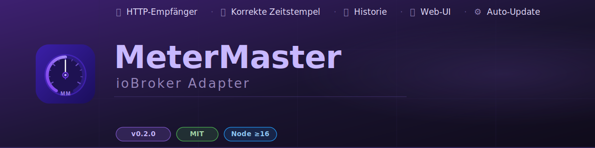

# ioBroker MeterMaster Adapter



[](https://github.com/MPunktBPunkt/iobroker.metermaster)
[](LICENSE)
[](https://nodejs.org)

Empfängt Zählerablesungen von der **MeterMaster Android-App** und speichert sie als ioBroker-Datenpunkte mit korrekten Zeitstempeln und vollständiger Historie.

---

## Features

- 📡 **HTTP-Empfänger** – nimmt Ablesungen direkt von der App entgegen
- 🏷️ **Automatische Datenpunkte** – States werden beim ersten Sync selbstständig angelegt
- 🕐 **Korrekter Zeitstempel** – `ts` des States entspricht dem echten Ablesedatum
- 📈 **Historie** – jeder Zähler hält einen vollständigen `readings.history`-Array
- 🔐 **Basic Auth** – optionaler Benutzername/Passwort-Schutz
- 🌐 **Web-UI** – eingebauter Browser-Viewer mit Daten-, Import- und Log-Tab
- 📥 **Import** – App-Backup (Schema 2.0) direkt über die Web-UI einspielen

---

## Installation

### Option A – direkt von GitHub (empfohlen)

```bash
iobroker add https://github.com/MPunktBPunkt/iobroker.metermaster
```

> Erfordert eine aktive Internetverbindung auf dem ioBroker-Server.

### Option B – manuell (ohne Internet / Offline)

```bash
# 1. Ordner anlegen
mkdir -p /opt/iobroker/node_modules/iobroker.metermaster

# 2. Dateien kopieren (USB, SCP, WinSCP …)
#    Zielordner: /opt/iobroker/node_modules/iobroker.metermaster/
#    Benötigte Dateien: main.js  io-package.json  package.json

# 3. Abhängigkeiten installieren
cd /opt/iobroker/node_modules/iobroker.metermaster
npm install

# 4. Adapter registrieren
cd /opt/iobroker
iobroker add metermaster
```

### Instanz konfigurieren

Nach der Installation erscheint der Adapter im ioBroker Admin unter **Adapter → MeterMaster**.  
Instanz anlegen und konfigurieren:

| Einstellung | Standard | Beschreibung |
|---|---|---|
| HTTP Port | `8089` | Port auf dem der Adapter lauscht |
| Benutzername | `metermaster` | Basic-Auth Username (App-Einstellungen) |
| Passwort | – | Basic-Auth Passwort (App-Einstellungen) |
| Ausführliches Logging | ✅ | Debug-Einträge im Log-Viewer anzeigen |
| Log-Puffer | `500` | Max. gespeicherte Log-Einträge |
| Historie aufbewahren | `0` | 0 = unbegrenzt, sonst max. Einträge pro Zähler |

### Adapter starten

```bash
iobroker start metermaster
```

Im ioBroker-Log erscheint:
```
[SYSTEM] MeterMaster Adapter v0.1.0 gestartet — Port: 8089 | Logging: ausführlich
[SYSTEM] Lauscht auf Port 8089 — Web-UI: http://IP:8089/
```

### Firewall (falls nötig)

```bash
sudo ufw allow 8089/tcp
```

---

## MeterMaster App konfigurieren

**Einstellungen → ioBroker → MeterMaster Adapter:**

| Feld | Wert |
|---|---|
| ioBroker aktivieren | ✅ |
| IP / Hostname | IP-Adresse des ioBroker-Servers |
| Adapter-Port | `8089` |
| Benutzername | wie im Adapter konfiguriert |
| Passwort | wie im Adapter konfiguriert |

Dann **„Verbindung testen"** → sollte `MeterMaster-Adapter erreichbar ✓` zurückgeben.

---

## Angelegte Datenpunkte

Nach dem ersten Sync erscheinen unter `metermaster.0`:

```
metermaster.0
  info.connection          – Adapter verbunden (boolean)
  info.lastSync            – Zeitpunkt letzter Sync (string)
  info.readingsReceived    – Ablesungen gesamt (number)

  └── MeinHaus
       ├── Westerheim
       │    └── Warmwasser
       │         ├── readings.latest      (number, ts = Ablesedatum)
       │         ├── readings.latestDate  (string, ISO-8601)
       │         ├── readings.history     (array, JSON)
       │         ├── name
       │         ├── unit
       │         └── typeName
       └── shared
            └── Stromzaehler
                 └── ...
```

**`readings.history` Format:**
```json
[
  { "value": 125.3, "unit": "m³", "readingDate": "2024-01-15T10:00:00.000Z", "ts": 1705312800000 },
  { "value": 128.7, "unit": "m³", "readingDate": "2024-02-12T09:30:00.000Z", "ts": 1707729000000 }
]
```

---

## Web-UI

Aufrufbar im Browser ohne Passwort:

```
http://192.168.178.113:8089/
```

| Tab | Inhalt |
|---|---|
| 📊 Daten | Alle empfangenen Zähler, gegliedert nach Haus/Wohnung, mit aufklappbarem Verlauf |
| 📥 Import | App-Backup (JSON, Schema 2.0) einspielen – Drag & Drop |
| 📋 Logs | Echtzeit-Log mit Filter nach Level/Kategorie, Auto-Scroll, Export |

---

## HTTP API

### Verbindungstest (ohne Auth)
```
GET http://host:8089/api/ping
→ { "ok": true, "adapter": "metermaster", "version": "0.1.0" }
```

### Einzelne Ablesung
```
POST http://host:8089/api/reading
Authorization: Basic base64(user:passwort)
Content-Type: application/json

{
  "house":       "MeinHaus",
  "apartment":   "Westerheim",
  "meter":       "Warmwasser",
  "value":       128.75,
  "unit":        "m³",
  "typeName":    "HotWater",
  "readingDate": "2024-02-12T09:30:00.000Z"
}
```

### Batch (mehrere Ablesungen)
```
POST http://host:8089/api/readings
→ Array von Ablesung-Objekten
→ { "ok": true, "stored": 14, "failed": 0, "errors": [] }
```

### Import (App-Backup)
```
POST http://host:8089/api/import
→ MeterMaster Schema-2.0-JSON
→ { "ok": true, "stored": 342, "skipped": 0, "failed": 0 }
```

---

## Update

### Option A – über die Web-UI (empfohlen)

Im Browser `http://IP:8089/` öffnen → Tab **⚙️ System** → **„Auf Updates prüfen"**.  
Ist eine neue Version auf GitHub verfügbar, erscheint der Button **„Update installieren"** — ein Klick genügt. Der Adapter aktualisiert sich selbst und startet automatisch neu.

### Option B – Kommandozeile

```bash
iobroker upgrade metermaster https://github.com/MPunktBPunkt/iobroker.metermaster
iobroker restart metermaster
```

### Option C – manuell (offline)

Neue Dateien per USB/SCP überschreiben, dann:
```bash
cd /opt/iobroker/node_modules/iobroker.metermaster
npm install
iobroker restart metermaster
```

---

## Changelog

### 0.2.9 (2026-03-07)
- **Bugfix:** Alle Nicht-ASCII-Zeichen im Browser-JS durch `\uXXXX`-Escapes ersetzt — der `U+FE0F Variation Selector-16` (unsichtbar, hinter ⚙️ etc.) verursachte `SyntaxError: Unexpected string` und blockierte das komplette Script

### 0.2.8 (2026-03-07)
- **Bugfix:** Externe `/app.js` rückgängig — relative URL wurde vom Browser gegen den ioBroker-Admin-Proxy (Port 8081) aufgelöst, nicht gegen Port 8089 → `ERR_CONNECTION_REFUSED`
- Zurück zu Inline-Script; alle top-level `addEventListener`-Aufrufe sind bereits in `initTabs()` (keine Crash-Möglichkeit)

### 0.2.7 (2026-03-07)
- **Bugfix:** JavaScript aus `<script>`-Block in separate `/app.js`-Route ausgelagert — der ioBroker-Admin-Proxy blockiert Inline-Scripts per CSP, externe Script-Dateien sind erlaubt

### 0.2.6 (2026-03-07)
- **Bugfix:** Tab-Wechsel: `<div>`-Elemente durch native `<button>` ersetzt — Klick-Events können durch Browser/CSP nicht geblockt werden
- `showTab()` als `window.showTab` verfügbar (globaler Scope, onclick-Attribut funktioniert zuverlässig)
- CSS-Reset für button-Elemente (kein Rahmen, kein appearance-Artefakt)

### 0.2.5 (2026-03-07)
- **Bugfix:** Cache-Wiederherstellung: Key-Format fehlte Namespace (`metermaster.0.`) → history/unit/typeName nie geladen, Daten-Tab immer leer
- **Bugfix:** `addEventListener`-Aufrufe liefen beim Script-Load synchron — bei `null`-Element `TypeError` → `init()` nie aufgerufen → Tabs ohne Funktion
- Alle EventListener in `initTabs()` verschoben (Dropzone, Log-Filter, System-Buttons)

### 0.2.4 (2026-03-07)
- **Bugfix:** Daten-Tab nach Adapter-Neustart leer — Cache wird jetzt beim Start aus ioBroker-States wiederhergestellt
- Version wird im Web-UI Header angezeigt
- Tab-Wechsel: robusteres Event-System mit Event Delegation + `pointer-events: all !important`
- Startlog: Version war hardcoded `v1.0.0` statt dynamisch

### 0.2.3 (2026-03-07)
- **Bugfix:** `validateReading()` war nicht definiert → `ReferenceError` beim ersten Sync → App meldet „unexpected end of stream"

### 0.2.2 (2026-03-07)
- **Bugfix:** Tab-Wechsel in manchen ioBroker-Umgebungen ohne Funktion — `onclick`-Attribute durch `addEventListener` ersetzt (robuster, CSP-kompatibel)
- `querySelector('[onclick=...]')` in `checkVersion()` durch `getElementById` ersetzt

### 0.2.1 (2026-03-07)
- **System-Tab** in der Web-UI mit GitHub-Versionscheck und Ein-Klick-Update
- `/api/version` vergleicht installierte Version mit aktuellem GitHub-Release
- `/api/update` führt `iobroker upgrade` aus und startet den Adapter automatisch neu
- **Bugfix:** `adapter.start()` entfernt — inkompatibel mit `@iobroker/adapter-core` v3.x
- **Bugfix:** `admin/`-Ordner ergänzt (`jsonConfig.json` + SVG-Icon) — Konfig-Seite war leer

### 0.1.0 (2026-03-06)
- Erstveröffentlichung
- HTTP-Empfänger mit Basic Auth
- Automatisches Anlegen von Datenpunkten
- Korrekte Zeitstempel (`ts` = Ablesedatum)
- `readings.history` mit vollständiger Ablese-Historie
- Web-UI mit Daten-Tab, Import-Tab und Log-Viewer
- Import von MeterMaster App-Backups (Schema 2.0)

---

## Lizenz

MIT © MPunktBPunkt
